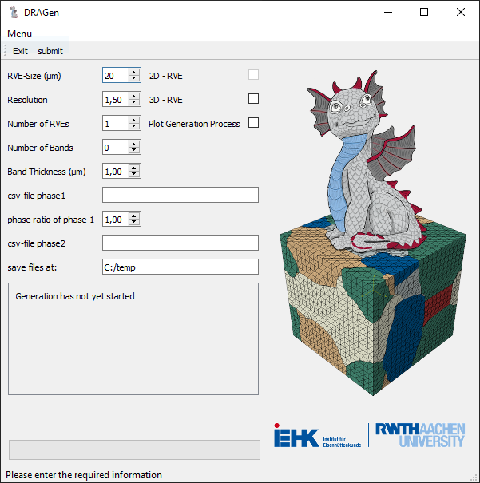

# DRAGen

This repository includes the official implementation of the paper [A Novel Approach to Discrete Representative Volume Element Automation and Generation-DRAGen](https://www.mdpi.com/1996-1944/13/8/1887). It is highly recommended to use Python versions 3.6 to 3.8. For Python 3.9 there are still some problems with PyVista.

## Overview

DRAGen is an approach for generating Representative Volume Elements (RVEs) based on a Random Sequential Addition (RSA)-Algorithm for discrete volumes and the tessellation using a discrete tessellation function. The input data are gathered from the analysis of electron backscatter diffraction (EBSD) pictures via MATLAB toolbox MTEX and introduced to the model. Subsequently, the generator follows the below mentioned steps:

* Randomly generating ellipsoids in volume (RSA)
* Filling empty spaces between ellipsoids (Discrete Tessellation)
* Validation of the newly created digital microstructure with input data

The results show that the generator can successfully reconstruct realistic microstructures with elongated grains and martensite bands from given input data sets.

## Input data

* a: grain radius (**mandatory**)
* b: grain radius (optional, default = a )
* c: grain radius (optional, default = a)
* alpha: grain slope in x-y-plane (optional, default = 0)
* beta: grain slope in other plane (not yet implemented)
* phi1: euler angle (optional, default: random)
* PHI: euler angle (optional, default: random)
* phi2: euler angle (optional, default: random)
 

| Header: | a | b | c | alpha | beta | phi1 | PHI | phi2 |
| --- | :---: | :---: | :---: | :---: | :---: | :---: | :---: | :---: |
| **Description:** | grain radius | grain radius | grain radius | grain slope x-y-plane | _soon_ | euler angle | euler angle | euler angle |
| **Required:** | mandatory | optional | optional | optional | _soon_ | optional | optional | optional |
| **Default:** |  | a | a | 0 | _soon_ | random | random | random |

 
DRAGen takes .csv files as input. Theses files must contain <ins>at least one radius</ins> for each grain. This radius has to be called <em>a</em> in the header.
 <ins>Optional parameters</ins> are:

1. _b_ and _c_ as second and third radius of each grain (ellipsoids are created).  _a_ is assumed to be oriented with the rolling direction and is aligned with x-axis,
_b_ is aligned with y-axis and _c_ with z-axis. 
2. If a slope relative to x-axis is detected (rotation in x-y-plane, around z-axis), _alpha_ can be used to implement this slope on the grains. 
_beta_ will be implemented in the future and will be a rotation around x- or y-axis. 
3. The texture can be defined with the parameters _phi1_, _PHI_ and _phi2_.

## Input generator

One additional feature of our system is the generation of statistically representative microstructur using **Generative Adversarial Networks**, a method from the field of deep learning. With our CWGAN-GP, it is possible to generate an unlimited amount of vaild synthetical microstructure. Possible for "normal" grain data, inclusions and even damage (coming soon!). For more information, see our article on the basic idea of using a WGAN (https://www.mdpi.com/1996-1944/13/19/4236) and our IDDRG post on the CWGAN-GP (coming shortly after publishing).

## soon to come
Release of beta v.1.0

## Contact

* Manuel Henrich M. Sc. <manuel.henrich@iehk.rwth-aachen.de>
* Maximilian Neite M. Sc. <maximilian.neite@iehk.rwth-aachen.de>
* Niklas Fehlemann M. Sc. <niklas.fehlemann@iehk.rwth-aachen.de>
* Orkun Karagüllü M. Sc. <orkun.karaguellue@iehk.rwth-aachen.de>

