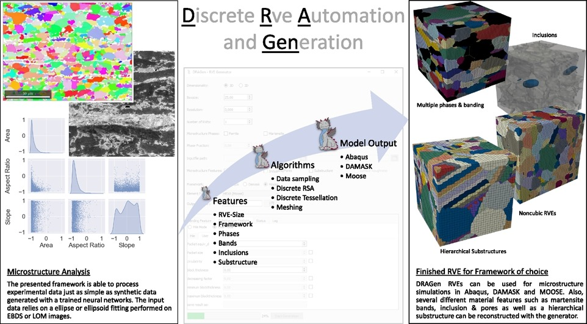

<h1> DRAGen - <ins>D</ins>iscrete <ins>R</ins>VE <ins>A</ins>utomation and <ins>Gen</ins>eration</h1>
<!--**D**iscrete **R**VE **A**utomation and **Gen**eration-->

<!--## Overview-->
<!---->

 [**Installation**](#Installation)
| [**Related Projects**](#Related-Projects)
| [**Tutorial**](Tutorial)


This repository presents an enhanced version of the Discrete Representative Volume Element (RVE) Automation and Generation Framework, known as DRAGen. Originally devised as an approach for generating Representative Volume Elements based on a Random Sequential Addition (RSA)-Algorithm and discrete tessellation, DRAGen has undergone significant improvements to broaden its capabilities. DRAGen collects and processes data from analysis of electron backscatter diffraction (EBSD) images via the [MATLAB toolbox MTEX](https://mtex-toolbox.github.io/)  or [OIM](https://www.edax.com/products/ebsd/oim-analysis) and presents it as a model. Subsequently, the generator follows the below mentioned steps:

* Randomly generating ellipsoids in volume (RSA)
* Filling empty spaces between ellipsoids (Discrete Tessellation)
* Validation of the newly created digital microstructure with input data

The updated framework incorporates a generator for RVEs with several advanced features, drawn from real microstructures. DRAGen now possesses the ability to read input data from trained neural networks and .csv files, offering greater flexibility in microstructure generation. Notably, the generator has been enriched to reconstruct microstructures with intricate features such as;

* Pores
* Inclusions 
* Martensite bands 
* Hierarchical substructures
* Crystallographic textures.

In addition to these enhancements, DRAGen has been extended to support different solvers. DRAGen is capable of creating models compatible with three widely used multiphysics frameworks: [DAMASK](https://damask.mpie.de/index.html), [Abaqus](https://www.3ds.com/products-services/simulia/products/abaqus/), and [MOOSE](https://mooseframework.inl.gov/).

Its versatility makes it a valuable tool for scientists in the Integrated Computational Materials Engineering (ICME) community. The modular architecture of the project facilitates easy expansion with additional features, ensuring that DRAGen delivers a diverse range of functions and outputs. This diversity offers a comprehensive spectrum of microstructures, thereby contributing to the advancement of microstructure studies and the development of innovative microstructure designs.

For more:

[A Novel Approach to Discrete Representative Volume Element Automation and Generation-DRAGen](https://www.mdpi.com/1996-1944/13/8/1887)

[DRAGen – A deep learning supported RVE generator framework for complex microstructure models](https://www.sciencedirect.com/science/article/pii/S2405844023062114#fg0340)

[Generating Input Data for Microstructure Modelling: A Deep Learning Approach Using Generative Adversarial Networks](https://www.mdpi.com/1996-1944/13/19/4236)

<p align="left"> </img></p>

_Note: For developing it is highly recommended to use Python versions 3.6 to 3.8. For Python 3.9 Pyvista is not fully supported._<br>
**If further questions appear please check the lower section or get in touch with us.**


## Installation

As the first step, conda needs to be installed.
To be sure conda is installed correctly on your system [look up here](https://docs.conda.io/projects/conda/en/latest/user-guide/install/index.html)<br>

Git must be installed on the system. Check with:
```
$ git --version
```
If it has not been installed use this:
```
$ conda install -c anaconda git
```
Open the user path and create the directory where the DRAGen repo will be cloned.
Should be like this:
```
(base) C:\Users> cd \Users\{username}
(base) C:\Users\username> mkdir GitRepos
(base) C:\Users\username> cd GitRepos
```
To clone this repository into the desired destination, use:<br>
```
$ git clone https://github.com/ibf-RWTH/DRAGen.git
```
To be able to use DRAGen, the working directory must be set to the location where the repo was downloaded to in the previous step file which is downloaded at the previous step.
Use the commands to go to the exact file by following the path.
```
$ cd DRAGen
```
To see the folders on the current point:
```
$ dir
```
Create a virtual environment as follows:<br>
```
$ conda create --name DRAGen python=3.8
$ conda activate DRAGen
```
(if an error occurs check your conda installation)<br>
To see the list of the environments on conda:
```
$ conda info --envs
```
Be sure the DRAGen environment is activated it should look somewhat like this:<br>
```
(DRAGen)....$ 
```
Install one of two required module packages depending on cuda availability on the device:

To install requirements without cuda:<br> 
```
(DRAGen)....$ pip install -r requirements.txt 
```
To install requirements if cuda is available:<br> 
```
(DRAGen)....$ pip install -r requirements_cuda.txt 
```
Check if every step is utilized correctly by running first generation with:<br>
```
(DRAGen)....$ python DRAGen_nogui.py
```
Run DRAGen:<br>
```
(DRAGen)....$ python DRAGen.py
```

## Related Projects

### MCRpy
<p align="center"> </img></p>

[MCRpy](https://github.com/NEFM-TUDresden/MCRpy) (Microstructure Characterization and Reconstruction in Python) facilitates the process by employing a range of descriptors and enables the reconstruction of new microstructures. One key advantage of MCRpy is its extensibility, allowing the combination of various descriptors without the need for loss functions. Additionally, it provides flexibility in choosing optimizers to address emerging optimization problems.


### DAMASK
<p align="center"> </img></p>

[DAMASK](https://damask.mpie.de/index.html) (Düsseldorf Advanced Materials Simulation Kit) excels in its ability to handle a variety of simulation programs under different conditions, particularly for advanced high-strength materials. Its capability to address the interconnected nature of deformation, phase transformations, heating effects, and potential damage makes DAMASK an invaluable choice for researchers and practitioners seeking a comprehensive understanding of materials behavior in diverse scenarios.


### Moose 

<p align="center"> </img></p>

[MOOSE](https://mooseframework.inl.gov/) (Multiphysics Object-Oriented Simulation Environment) framework is an open-source software framework designed for solving complex physics-based engineering simulations. Moose supports adaptive mesh refinement which improves the accuracy and efficiency. It is possible to develop a simulation application tailored to specific needs. 


### MTEX

<p align="center"> </img></p>

[MTEX](https://mtex-toolbox.github.io/index) (Materials Texture and Microstructure Analysis Toolbox) is an open-source Matlab tool that allows data processing using techniques such as EDSB, and analysis on microstructure and crystallographic textures. It has powerful visualization tools for displaying crystallographic data, including pole figures, stereographic projections, and other graphical representations of orientation information.


